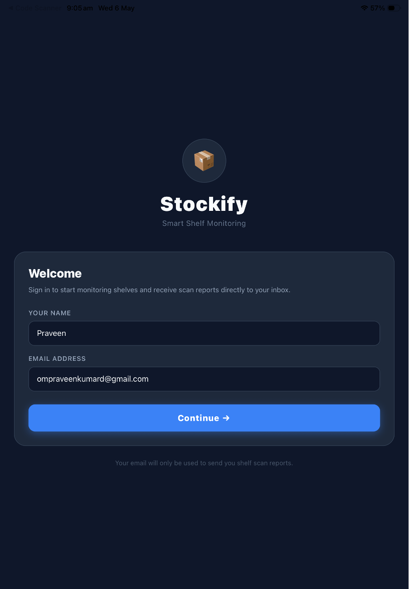
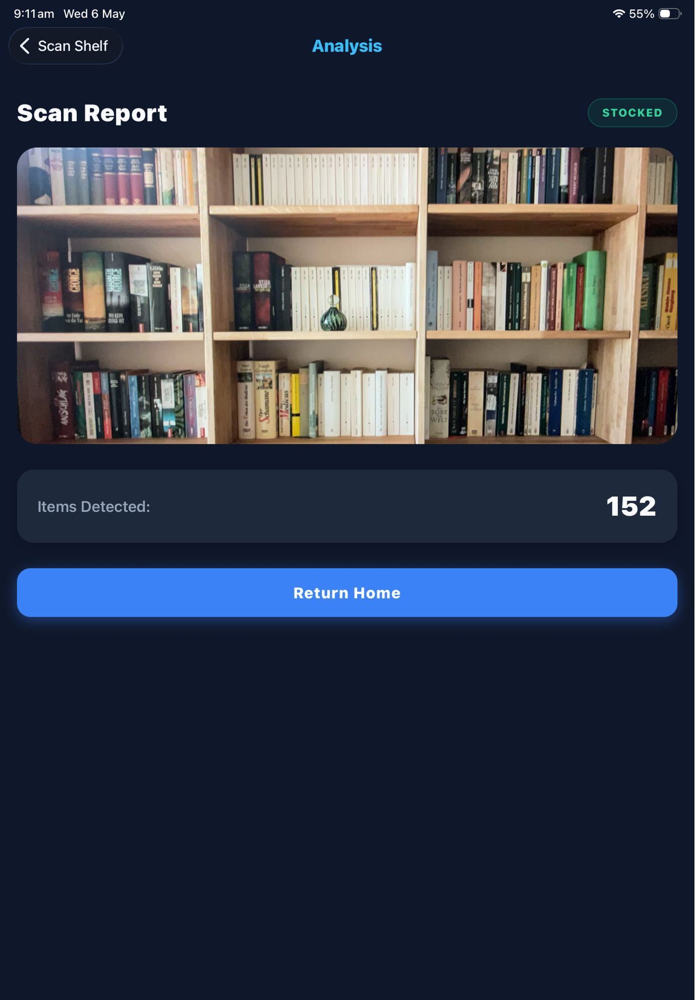
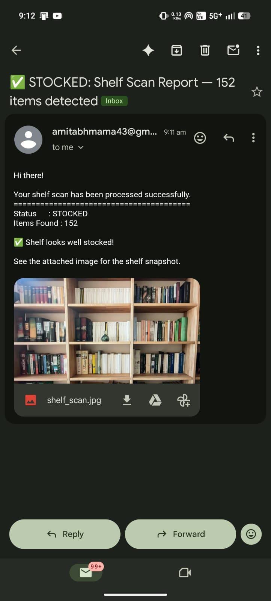
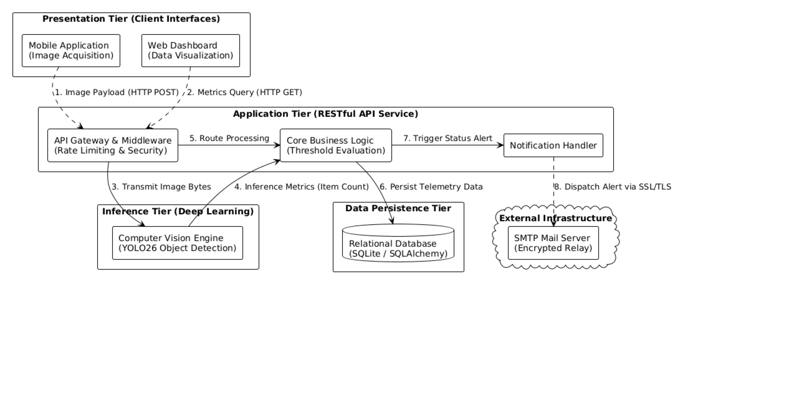
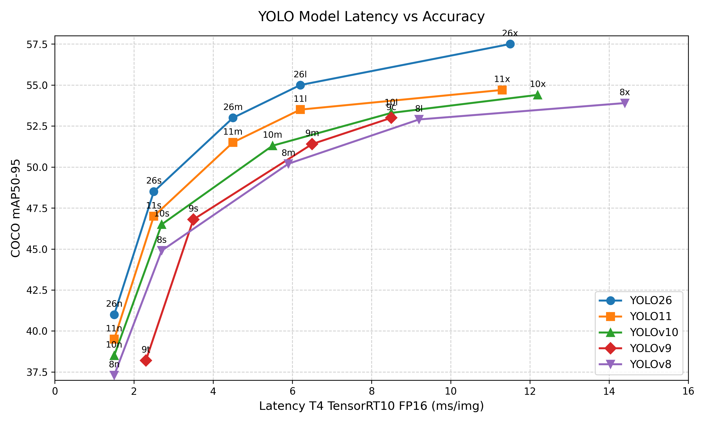

<div align="center">
  <h1>🛒 Smart Shelf Stock Monitoring Application</h1>
  <p>
    
    
    
    
    
  </p>
  <p><i>A full-stack, AI-powered system designed to automate inventory management and shelf-stocking for retail environments.</i></p>
</div>

---

## 📖 Table of Contents
- [About the Project](#-about-the-project)
- [Project Structure](#-project-structure)
- [Getting Started](#-getting-started)
  - [1. Backend Service](#1-setting-up-the-backend-fastapi--yolov26)
  - [2. Admin Dashboard](#2-setting-up-the-admin-dashboard-react--vite)
  - [3. Mobile App](#3-setting-up-the-mobile-app-react-native--expo)
- [Troubleshooting](#-troubleshooting)
- [Security](#-security)

---

## 🌟 About the Project

This application allows store associates to capture images of shelves using a mobile device, which are then analyzed using advanced Computer Vision models (**YOLOv26**) to count items automatically. An admin dashboard provides real-time oversight of inventory health across the store.

<div align="center">
  <h3>📱 Project Screenshots</h3>
  
  
  
</div>

## 📐 Architecture Diagram

<div align="center">
  
</div>

## 📊 YOLO Model Comparison

The following graphs highlight the performance of YOLOv26 compared to previous iterations in both accuracy and latency.

<div align="center">
  
  
</div>

<div align="center">
  
</div>

## 🏗 Project Structure

The repository is divided into three interconnected micro-services:

| Component | Stack | Description |
| :--- | :--- | :--- |
| 🐍 **`backend/`** | Python, FastAPI, YOLOv26, SQLite | Core AI processing, database management, and business logic API. |
| 💻 **`admin-dashboard/`** | React, Vite, Tailwind CSS | Web application providing a centralized command center for inventory status. |
| 📱 **`mobile/`** | React Native, Expo | Mobile interface used by on-floor staff to capture shelf images. |

---

## 🚀 Getting Started

Follow these detailed steps to set up and run all three components locally.

### 1. Setting up the Backend (FastAPI + YOLOv26)

The backend handles image processing, database storage (`SQLite`), and API requests.

**Prerequisites:** Python 3.9+

```bash
# 1. Navigate to the backend directory
cd backend

# 2. Create a virtual environment (recommended)
python3 -m venv venv

# 3. Activate the virtual environment
# On Mac/Linux:
source venv/bin/activate
# On Windows:
# venv\Scripts\activate

# 4. Install the required dependencies
pip install -r requirements.txt

# 5. Run the FastAPI development server
uvicorn main:app --reload --host 0.0.0.0 --port 8000
```
> **Tip:** The backend API will now be running at `http://localhost:8000`. You can view the interactive Swagger API documentation at [`http://localhost:8000/docs`](http://localhost:8000/docs).

### 2. Setting up the Admin Dashboard (React + Vite)

The admin dashboard provides real-time statistics and history logs for shelf checks.

**Prerequisites:** Node.js (v16+ recommended)

```bash
# 1. Open a new terminal window and navigate to the admin dashboard directory
cd admin-dashboard

# 2. Install Node dependencies
npm install

# 3. Start the Vite development server
npm run dev
```
> **Tip:** The admin dashboard will now be running, typically at [`http://localhost:5173`](http://localhost:5173).

### 3. Setting up the Mobile App (React Native + Expo)

The mobile application is used to capture photos of the shelves and send them to the backend.

**Prerequisites:** Node.js, **Expo Go** app installed on your physical mobile device.

```bash
# 1. Open a new terminal window and navigate to the mobile directory
cd mobile

# 2. Install Node dependencies
npm install

# 3. Start the Expo development server
npm start
```

#### 📱 Running on a Physical Device:
1. Ensure your phone and computer are connected to the **same Wi-Fi network**.
2. Open the **Expo Go** app on your device.
3. Scan the QR code displayed in your terminal or browser.

---

## 🛠 Troubleshooting

<details>
<summary><b>Mobile App cannot connect to the Backend</b></summary>
<br>
If you are running the mobile app on a physical device, <code>localhost</code> inside the mobile app's code points to the phone itself. You need to update the API URLs (e.g., in Axios calls) inside the <code>mobile</code> codebase to use your computer's local IP address (e.g., <code>http://192.168.1.x:8000/api/detect</code>).
</details>

<details>
<summary><b>Missing Database Error</b></summary>
<br>
The backend uses SQLite natively. The <code>shelf_stock.db</code> file is automatically created in the <code>backend/</code> folder when you run the FastAPI server for the first time.
</details>

---

## 🔒 Security

*   **Rate Limiting:** The API uses `slowapi` to enforce rate-limiting (e.g., 10 requests/minute for object detection) preventing abuse.
*   **Security Headers:** Strict headers (HSTS, No-Sniff, Frame-Options) are enabled by default on the backend via custom middleware.
